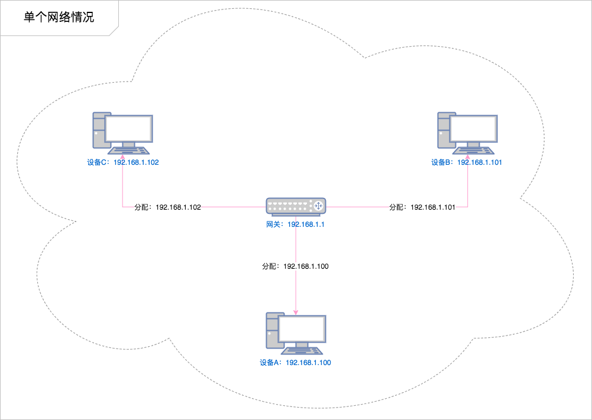
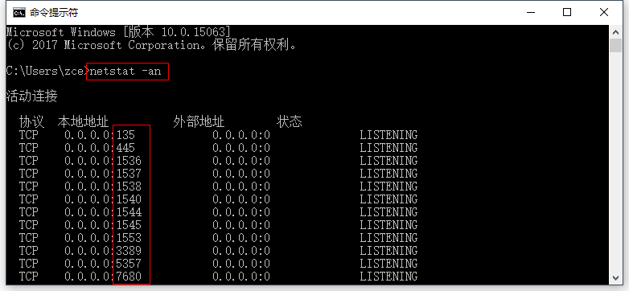

# 第一天 服务端开发基础

## 每日目标

- 能够说出访问网址时请求与响应的流程
- 能够说出什么是IP、DNS、端口
- 能够安装并使用apache服务器
- 能够说出索引数组与关联数组的区别
- 能够声明和调用自定义函数
- 综合案例：**水果列表案例**

### 之前学习了什么？

在之前的学习过程中，我们很专注，没有关心这些东西在整体中是什么角色，起到什么作用。这里我们是时候总结一下我们之前学过了的内容：

- 网页开发技术（硬性）
  - HTML —— 网页内容结构（GUI）
  - CSS —— 网页外观样式（GUI）
  - JavaScript —— 编程语言（**可以用于**调用浏览器提供的 API）
  - Web APIs —— 网页交互（界面功能）
  - jQuery —— 便捷手段（糖果而已，不是必要的）
- 编程能力 / 编程思想 / 解决问题的思路（软性）
  - 我要做什么（我要得到什么），我目前有什么（我能拿到什么）

至此，我们已经可以独立完成网页开发了，具体能完成的东西就是一个一个的网页，而且还能给这个页面加上一些动态的交互。但是这距离成为一个网站还有一些路要走。

```flow
webpage=>operation: 网页开发
website=>operation: 网站开发
application=>operation: 应用开发

webpage(right)->website(right)->application
```

### 访问一个网站时发生了什么？(重要)


##后台开发在当前前端领域的需求现状


##我们为什么会选择php语言

- PHP是用于网页服务器端编程的脚本语言。WEB服务器是安装了WEB服务器软件的计算机，存储网站脚本程序

- 用户请求对应脚本时，服务器执行对应的脚本并返回执行结果

- 市场现状：

   

  ​

## 建立你的第一个网站（大目标）

> **前端开发** 最终还是属于 **Web 开发** 中的一个分支，想要成为一名合格的前端开发人员，就必须要 **充分理解 Web 的概念**。

构建一个专业的网站是一项巨大的工作！对于新手我们应该从小事做起，也就是说咱们不可能立马就要求自己能够开发出跟淘宝一样的电商平台，但是对咱们来说建立一个属于自己的 Blog 网站并不难（其实再大的系统也是由一些基础功能叠加出来的），所以咱们就从这个话题开始聊。

### 还需要学习什么？

想要完成完整的 Web 网站，还需要学习什么？

- 搭建 WEB 服务器（提供网站服务的机器）
- 服务端开发（动态网页技术）
- HTTP（浏览器与服务端的通讯协议）
- 数据库操作（服务端存储数据方式）
- AJAX（浏览器与服务端的数据交互方式）


## 什么是 Web 服务器

> - 服务器（提供服务）指的就是一台**安装特定的软件的计算机**，用于专门用于提供特定的服务。
>   - 按照服务类型的不同，又划分为：Web 服务器、数据库服务器、文件服务器等等。
> - 客户端（使用服务）指的是在一次服务过程中使用这个服务的设备（网络端点）。
>   - 目前咱们最常见的客户端就是浏览器

我们手头上的这些网页，如果想要成为一个网站，首先要完成的第一件事就是有一台公共的 Web 服务器，把这一系列的页面放到这台 Web 服务器上，让用户可以通过服务器的地址访问到这些网页。


> 思考：为什么不把这些网页放在我们自己电脑上呢？

那么，哪里有这样的服务器呢？

我们手头上的电脑都可以是一台服务器，因为服务器是一个相对的概念，只要能提供服务就可以是一个服务器（提供服务的时候就是服务端，使用服务的时候就是客户端）。

既然服务器就是安装特定的软件的计算机，那么要让自己的成为 Web 服务器就是要安装一个 Web 服务器软件。

### C/S 架构与 B/S架构 (重要)
> 应用软件架构一般分为两类：
>
> - B/S 架构：Browser（浏览器） ←→ Server（服务器），这种软件都是通过浏览器访问一个网站使用，服务器提供数据存储等服务。
> - C/S 架构：Client（客户端） ←→ Server（服务器），这种软件通过安装一个软件到电脑，然后使用，服务器提供数据存储等服务。

B/S的优点与缺点：

​	优点：部署方便(不用安装)，可维护性强。

​	缺点：用户体验不好，不能针对每一个用户的不同特点进行设置

C/S的优点与缺点：

​	优点：用户体验好

​	缺点：部署不方便(需要安装)，可维护性弱	

## 网络基础概念（重要）

### IP 地址

> Internet Protocol Address

设备在某一个网络中的地址，目前最常见的格式：`[0-255].[0-255].[0-255].[0-255]` 即为四个 0-255 的数字组成。  192.168.83.77

作用就是标识一个网络设备（计算机、手机、电视）在**某一个具体的网络**当中的地址。

127.0.0.1 是本地回环地址 localhost：用来测试本机服务器是否连通

#### 单个网络情况

在单个局域网下，结构非常简单，就是我们所连接的网络设备（网关）给我们分配了一个地址，在**这个范围之内**我们都可以通过这个地址找到我们的这个设备。

> 如果设备没有连接任何网络情况下，我们会有一个本地回环地址 127.0.0.1



#### 多个网络情况

但是当一个设备同时处于多个网络下（比如同时连接了有线网卡和无线网卡），就会变得稍微复杂一点：


> 例如：
>
> 小明这个同学同时报名了两个课程，在 A 班级小明是班长，所有 A 班级的同学都管他叫班长（叫班长就能找到他）。而在 B 班级小明是课代表，所有 B 班的同学都管他叫课代表（叫课代表就能找到他）。
>
> 同样的一个人在不同的环境有不同的身份，这些身份只有特定的环境才生效。

> 纸上得来终觉浅，绝知此事要躬行！多尝试，多思考才能更好的理解这个问题。

### 域名

由于 IP 地址都是没有规律的一些数字组成的，很难被人记住，不利于广泛传播，所以就有人想出来要给 IP 起名字（别名）。

> 域名是需要花钱注册的

#### 特殊的域名
`localhost` 含义为本地主机，对应127.0.0.1 。这是一个保留域名，主要用于本地测试。

#### 顶级域名（了解）
.com: 商业机构 
.cn: 中国国家、地区域名 .hk,
.gov: 政府网站。
.org: 机构。
.edu: 教育网站。
.net: 网络服务商。   php.net
.mil: 军事。

### DNS

通过宽带运营商提供的服务器解析一个域名背后对应的 IP，这个过程叫做 **DNS 寻址**，帮你完成 DNS 寻址过程的服务器叫做 **DNS 服务器**。

#### hosts 文件

操作系统在发起对 DNS 服务器的查询请求之前，会优先检查本机的 hosts 文件。如果这个文件中包含了对当前需要解析的域名的配置，则不再发起对 DNS 服务器的请求，直接使用 hosts 文件中的配置。

**文件所在路径：**

- Windows：`C:\Windows\System32\drivers\etc\hosts`
- macOS：`/etc/hosts`

> **注意：**
>
> - 本机的 hosts 文件配置只能到影响本机的 DNS 寻址
> - 只有以管理员权限运行的编辑器才有权利修改 `hosts` 文件

### 端口

计算机本身是一个封闭的环境，就像是一个大楼，如果需要有数据通信往来，必须有门，这个门在术语中就叫端口，每一个端口都有一个编号，每台计算机只有 65536 个端口（0-65535）。

> 一般我们把“占门”的过程叫做监听

可以通过在命令行中运行： `netstat -an` 命令监视本机端口使用情况：



> 参考链接：
>
> - https://baike.baidu.com/item/%E6%9C%8D%E5%8A%A1%E5%99%A8%E7%AB%AF%E5%8F%A3
> - https://baike.baidu.com/item/%E7%AB%AF%E5%8F%A3
> - `http` 默认的端口 `80`
> - `https` 默认的端口是 `443`

### URL

URL（Uniform Resource Locator），统一资源定位符，通俗点来说就是表示网络当中某一个网页的完整访问地址，它具有一定的格式：

-- 协议名称://域名:端口/文件目录(文件名称)?key=value&key2=value2

例如：https://itcast.cn:80/schools/students?id=18&name=zce#photo

## 请求响应流程 (重要)


1. 用户打开浏览器
2. 地址栏输入我们需要访问的网站网址（`URL`）
3. 浏览器通过  `DNS 服务器` 获取即将访问的网站  `IP 地址`
4. 浏览器发起一个对这个 IP地址的 `请求`
5. 服务端监听指定的 `端口` 的服务器软件接收到这个请求，进行相应的处理
6. 服务端将处理完的结果返回给客户端浏览器（`响应`）
7. 浏览器将服务端返回的结果呈现到界面上

### Web 服务器软件分类（了解）

- Nginx
- Apache  -  php
- IIS  -  C#    .net
- Tomcat  -   java

## 安装 phpStudy

这里我们选择一个简单易用的服务器软件集成环境，内部集合了我们需要使用的服务器软件Apache、服务端开发语言php的执行环境、以及数据库软件MySQL。

> - 下载地址与使用说明：http://www.phpstudy.net/download.html

安装方式如下，解压后，双击运行phpStudySetup.exe：


界面会提示安装路径，使用默认路径即可，点击`是`：


接下来等待安装完毕：


安装完毕后可能会弹出更新提示，跳过即可(如果没有则可忽略)。界面会呈现如下效果：


点击启动，等待左侧红点变为绿色即为启动成功，现在可以打开浏览器，在地址栏中输入localhost并点击回车，页面会显示`Hello World`，恭喜你，phpStudy成功的安装完毕啦！~


## phpStudy的基本使用

### 监听端口（了解）

监听端口可以随意修改为任意一个未被其他程序监听的端口，可以通过点击phpStudy软件底部右侧 `其他选项菜单` 中 `phpStudy 设置` 中的 `端口常规设置` 进行设置。(采用默认80即可)


### 网站根目录与默认文档

> **网站根目录** 就是存放我们网站文件的最顶层目录，通常 URL 中域名后面的第一个斜线对应（映射）的就是网站根目录。
>
> **默认文档** 又称为默认首页，指的是客户端访问的是一个目录（没有指定具体的文件），服务端默认返回这个目录下的某个文档（文件），这个文档就称之为**默认文档**

如果需要设置网站根目录与默认文档，可以通过点击phpStudy软件底部右侧 `其他选项菜单` 中 `phpStudy 设置` 中的 `端口常规设置` 进行设置。


**注意：网站根目录不要包含中文字符，否则会导致apache服务器无法正常**

### 开启目录列表

当我们访问一个目录时，如果没有指明要访问的文件，则会访问 `默认文档` (见上一节)，但如果没有默认文档时，访问文件就不那么方便了。

此时可以开启 `目录列表` 功能，方便文件的查看。设置方式如下：


> 注：开启目录列表后，localhost无法访问（其他路径不影响），则删除网站根目录下的 l.php 即可。

### 虚拟主机 (了解)

如果一台机器上只有一个网站的话，没有任何问题，但是如果想要在一台机器上部署多个站点，就必须通过配置虚拟主机的方式解决。

找到虚拟主机配置位置，点击phpStudy软件底部右侧 `其他选项菜单` 中的 `站点域名管理`。

> 初次打开时，每个选项中有均默认的示例配置，可以直接修改为需要的值


> 配置中标红的位置中第一个为虚拟主机的域名，第二个为当前虚拟主机的网站根目录，第三个为第二域名(相对第一个域名简短一些，方便使用，不是必须的)，端口无需修改。(例如此处设置域名为 `www.day1.cn` ，目录为`C:\phpStudy\PHPTutorial\WWW\day1`, 第二域名为 `day1.cn`)

> 修改完毕后点击 `新增` ，然后点击 `保存设置并生成配置文件`，phpStudy会自动重启。


虚拟主机配置完毕后，如果真的要使用 `www.day1.com` 这个域名的话，还需要通过修改 `hosts` 文件达到目的，原因很简单：这个域名不是我们自己的，我们没有办法修改这个域名在公网上的 DNS。

找到hosts文件位置或直接从phpStudy中进入，点击phpStudy软件底部右侧 `其他选项菜单` 中的 `host`即可。配置方式见上一节 `网络基础概念` 中 `DNS` 中 `hosts文件` 部分。


> 注意：
>
> - 如果使用了虚拟主机，则默认必须全部使用虚拟主机，即之前的默认网站也必须通过虚拟主机方式配置，否则访问不到。参考：http://skypegnu1.blog.51cto.com/8991766/1532454

#### 配置第一个虚拟主机

- 单击“其它选项菜单” 》 “站点域名管理",在弹出的对话框中 设置 ”站点域名“，”目录“，”第二域名“，”端口“，之后单击”新增“，同时单击”保存设置并添加到配置文件“
- 配置hosts文件，在这个文件中添加当前的域名映射。单击”其它选项菜单“>"打开host"
- 如果当前目录下没有默认可执行文件，那么就会报错，如果想展示目录结构，就需要通过修改配置文件的方式来实现。”其它选项菜单“>”打开配置文件">"vhots-ini"  :Options Indexes FollowSymLinks ExecCGI
- 重启服务器(通过phpstudy面板进行的设置 ，服务器会自动的重启，但是如果手动的设置修改了配置文件，那么就需要手动的重启服务器)

#### 配置第二个虚拟主机

- 单击“其它选项菜单” 》 “站点域名管理",在弹出的对话框中 设置 ”站点域名“，”目录“，”第二域名“，”端口“，之后单击”新增“，同时单击”保存设置并添加到配置文件。
- 产生了新的问题：它会重新的生成配置文件内容并写入，会将之前对day1.com的配置重新覆盖，造成无法展示目录结构--重新添加Indexes,并重启服务器
- 配置hosts文件，在这个文件中添加当前的域名映射。单击”其它选项菜单“>"打开host"

### Apache 与 PHP

对于很多初学者来说，很容易把 Apache 和 PHP 混在一起 混为一谈，其实他们两者各自有各自负责的领域，各自的职责，但是我们在使用 PHP 做动态网站开发时，两者就会产生联系，具体如下：

> Apache 是根据文件的扩展名找到文件的类型，然后挨个问一下每一个模块能否处理这个类型的文件，如果这些模块都不能处理，那么 Apache 就自己处理（按照静态文件的方式处理）


> 你可以理解为：Apache 是一家没有太多能力的公司，只能处理一些简单的业务（静态网站），但是心很大想做更多的事（动态网站），所以就想到了外包，所有额外的业务都需要外包给其他程序，而 PHP 就是理解为一个专门能够处理 php 业务的外包公司


## PHP

> 详细参考文档：http://php.net/manual/zh/index.php

### 起步

> - PHP 是什么？
> - PHP 写在哪？
> - PHP 能做啥？

> 超文本标记是用普通文本描述富文本的一种方式
>
> 富文本：有格式的文本

PHP（PHP: Hypertext Preprocessor）是一种被广泛应用的脚本语言，它可以被嵌入到 HTML中，尤其适合做动态网站开发开发。

## php语言的特点

- 开源（open source）软件，跨平台，常用操作系统稳定执行。Windows / Linux。做WEB开发的经典组合 WAMP,LAMP基本都是开源软件。
- 入门简单,用户只需要关注应用，开发成本低。
- 支持的大多数主流数据库。MySQL，oracle,Redis等
- 存在大量针对PHP开发的框架。如Laravel,ThinkPHP,Yii,CoderIgniter,Symfony等，加快开发速度

我们接下来会在 PHP 中看到的许多代码特性和其他编程语言类似，例如：变量、函数、循环，等等。 代码语法看起来略有不同，但是在概念上是基本类似的。

我们使用 PHP 的目的就是能让静态网页变成动态网页，能称之为动态网页的核心就是让 HTML 上的内容不再被写死，而是通过在 HTML 中嵌入一段可以在服务端执行的代码(php)，从而达到动态网页的目标。

例如：我们需要有一个网页，这个网页每次打开都可显示当前的年月日，如果采用 HTML 处理：

```html
<!DOCTYPE html>
<html lang="en">
<head>
  <meta charset="UTF-8">
  <title>当前日期</title>
</head>
<body>
  <h1>2020-01-01</h1>
</body>
</html>
```

我们必须每天到服务器上修改这个网页，从而让它保持显示最新日期，但是有了 PHP 这种能够在服务端执行的脚本语言就可以很轻松实现：

```php
<!DOCTYPE html>
<html lang="en">
<head>
  <meta charset="UTF-8">
  <title>当前日期</title>
</head>
<body>
  <h1><?php echo date('Y-m-d'); ?></h1>
</body>
</html>
```

从以上这个最最简单的基础案例就能看出：PHP 无外乎为了可以在网页中动态输出最新内容的一种技术手段。

> 历史使人明智：http://php.net/manual/zh/history.php.php

### PHP 标记

> http://php.net/manual/zh/language.basic-syntax.phpmode.php

- `<?php` 可以让代码进入“PHP 模式”
- `?>` 可以让代码退出“PHP 模式”

```php
<!DOCTYPE html>
<html lang="en">
<head>
  <meta charset="UTF-8">
  <title>这是一个包含 PHP 脚本的网页</title>
</head>
<body>
  <h1>这是一个包含 PHP 脚本的网页</h1>
  <p>这里原封不动的输出</p>

  <?php
  // 这里是 PHP 代码，必须满足 PHP 语法
  $foo = 'bar';
  echo $foo;
  ?>

  <p>这里也不变</p>

  <p><?php echo '<b>这还是 PHP 输出的</b>'; ?></p>
</body>
</html>
```

类似于在 HTML 中使用 JavaScript，但是不同的是 JavaScript 运行在客户端，而 PHP 运行在服务端。

**只有处于 PHP 标记内部的代码才是 PHP 代码，PHP 标记以外都原封不动。

### 输出内容方式

- echo：

  ```php
  <?php
  // echo 是 PHP 中的一个特殊的“指令”，
  // 不一定需要像函数那样通过 `()` 去使用
  // 注意：echo 后面紧跟着一个空格
  echo 'hello php';
  echo 'hello', 'world';
  // => `helloworld`
  ```

- print：

  ```php
  <?php
  // print 与 echo 唯一区别就是只能有一个参数
  print 'hello php';
  // print 'hello', 'world';
  // => Parse error: syntax error ...
  ```

- var_dump：

  ```php
  <?php
  // var_dump 是一个函数，必须跟上 () 调用
  // 可以将数据以及数据的类型打印为特定格式
  var_dump('hello php');
  // => 'string(9) "hello php"'
  ```

> 还有一些输出函数（可以通过查手册自学，用到再说），例如：`exit()` / `print_r()` 等等

### 与 HTML 混编

- 普通嵌入

  ```php
  <p><?php echo 'hello'; ?></p>
  ```

- 语句混编

  ```php
  <?php if ($age >= 18) { ?>
    <p>成年人</p>
  <?php } else { ?>
    <p>小朋友</p>
  <?php } ?>
  ```

  还可以这样：

  ```php
  <?php if ($age > 18): ?>
    <p>成年人</p>
  <?php else: ?>
    <p>小朋友</p>
  <?php endif ?>
  ```

### 注释

你可以在代码中添加注释，从而增强我们代码的可阅读性。PHP 中注释有两种方式（与 JavaScript 相同）：

- 单行注释

  ```php
  <?php
  // 这是一条单行注释
  # 井号也可以做注释（不要用，有点生僻）
  $foo = 'hello';
  ```

- 多行注释

  ```php
  <?php
  /*
  ......
  这里可以添加任意行数的注释内容
  ......
  */
  $foo = 'hello';
  ```

### 语法

编程语言常见的语法

- 变量 —— 用于临时存放数据的容器
- 顺序结构 —— 先干什么再干什么
- 分支结构 —— 如果怎样就怎样否则怎样
- 循环结构 —— 不断的做某件相同的事
- 函数 —— 提前设计好一件事怎么干，然后想什么时候干就什么时候干
- 运算符 —— 数学运算和字符串拼接
- 字面量 —— 在代码中用某些字符组成，能够表达一个具体的值 这些字符之间表示数据的方式叫做字面量

PHP 也是另外种编程语言，作为另外一种编程语言，PHP 也具备着绝大多数语言都有的特点，例如变量、条件分支、循环、函数等等，不同的是每个语言都会有自己的语法规定。这里不用太过担心，这些语法规定与之前学习的编程语言大同小异，对我们来说不会有太大的压力。

以下是重点注意的问题：

1. 变量
2. 双引号字符串和单引号字符串的差异
3. 指令式的语法
4. foreach
5. 函数作用域问题
6. 字符串拼接

#### 变量

> 变量是编程语言中临时存放数据的容器。

PHP 中申明一个变量是用一个美元符号后面跟变量名来表示。变量名同样是区分大小写的。

PHP 中变量无需声明类型，变量的类型根据值的类型来推断。

```php
<?php
$foo; // 申明一个变量，变量名为 `foo`，未对其进行赋值
$bar = 'baz'; // 申明一个变量，将一个值为 `baz` 的字符串赋值给它
echo $foo; // 输出一个变量名为 `foo` 的变量
fn($bar); // 将一个变量名为 `foo` 的变量作为 `fn` 的实参传递
```

#####常用函数

1. isset():判断变量是否定义了，同时它还可以判断变量的值是否为null,如果定义了且值不为null,则返回true,否则返回false
2. empty():判断变量是否为空值，为空的值有：""  0 "0",null,false,array().如果值为以上中的某一个，则返回值
3. unset():删除变量
   - 如果删除一个变量，那么变量的值会置为null
   - 可以同时删除多个变量
   - 如果在函数中删除全局变量，那么并不会真正的将全局变量删除(以后再说)

#### 数据类型(了解)

常见的 PHP 数据类型与 JavaScript 基本一致：

- string（字符串） **
- integer（整型）—— 只能存整数
- float（浮点型）—— 可以存带小数位的数字
- boolean（布尔型）
- array（数组） **
- object（对象）
- NULL（空）

数据类型的分类：

- 基本数据类型：string（字符串） integer（整型） float（浮点型） boolean（布尔型）
- 复合数据类型： array（数组） object（对象）
- 特殊数据类型：NULL（空） 资源

判断数据类型：

- is_string():判断当前变量是否是字符串类型
- is_bool():判断当前变量是否是布尔类型
- is_int():判断当前变量是否是整形类型
- is_float():判断当前变量是否是浮点类型
- is_array():判断当前变量是否是数组类型
- is_object():判断当前变量是否是对象类型

##### 字符串（重要）

PHP 有多种创建字符串的方式：单引号、双引号等。

- 单引号字符串
  - 不支持特殊的转义符号，例如 `\n`
  - 如果要表示一个单引号字符内容，可以通过 `\'` 表达
  - 如果要表示一个反斜线字符内容，可以通过 `\\` 表达
- 双引号字符串
  - 支持转义符号：\"  \\  \$  \r \n \t
  - 支持变量解析

```php
<?php
// ====== 单引号 ======
echo 'hello\nworld';
// => `hello\nworld`
echo 'I\'m a better man';
// => `I'm a better man`
echo 'OS path: C:\\Windows';
// => `OS path: C:\Windows`

// ====== 双引号 ======
echo "hello\nworld";
// => `hello
// world`
$name = 'zce';
echo "hello $name";
// => `hello zce`
```

> 字符串函数
>
> - http://php.net/manual/zh/ref.strings.php
> - http://www.w3school.com.cn/php/php_string.asp

##### 数组（重要）

PHP 中数组可以分为两类：

- 索引数组

  与 JavaScript 中的数组基本一致

  ```php
  <?php
  // 定义一个索引数组
  $arr = array(1, 2, 3, 4, 5);
  var_dump($arr);

  // PHP 5.4 以后定义的方式可以用 `[]`
  $arr2 = [1, 2, 3, 4, 5];
  var_dump($arr2);
  ```

- 关联数组

  有点类似于 JavaScript 中的对象

  ```php
  <?php
  // 注意：键只能是`integer`或者`string`
  $arr = array('key1' => 'value1', 'key2' => 'value2');
  var_dump($arr);

  // PHP 5.4 以后定义的方式可以用 `[]`
  $arr2 = ['key1' => 'value1', 'key2' => 'value2'];
  var_dump($arr2);
  ```

#### 数据类型转换

> 参考：http://php.net/manual/zh/language.types.type-juggling.php

```php
<?php
$str = '132';
// 将一个内容为数字的字符串强制转换为一个整形的数字
$num = (int)$str;
// 将一个数字强制转换为布尔值
$flag = (bool)$num;
```

#### 运算符

数学运算符，逻辑运算符与 JavaScript 基本一致，无额外特殊情况。

注意：字符串连接（拼接）采用的是比较特殊的 `.`

```php
<?php
$name = 'zce';
// 拼接 `hey ` 和 `zce`
$message = 'hey ' . $name;
// 相当于 +=
$foo .= $message
```

#### 语句

- 分号分割
- if、switch、while、for、 foreach、function......

#### 流程控制

- 顺序结构

- 分支结构

  - if ... else
  - switch ... case

- 循环结构

  - for

  - while

  - foreach --- 专门用来遍历数组

    ```php
    <?php
    $arr = array('name' => 'zhangsan', 'age' => '18');

    foreach ($arr as $key => $value) {
      echo $key . ' ' . $value;
    }
    ```

指令式的 if、for、foreach、while 单独掌握

```php
<?php
// 指令式就是将开始 { 换成 :  结束 } 换成 endif;
if ($i > 0) :
  echo 'ok'
endif;

// for foreach while 也是一样
for ($i = 0; $i < 10; $i++) :
  echo $i;
endfor;
```

#### 函数

定义与使用函数的方式与 JavaScript 相同：

```php
<?php
// 函数名不区分大小写
function foo ($name, $title) {
  echo "$name ($title)";
}

// 调用
foo('zce', 'UFO');
Foo('zgd', 'SBO'); // 大小写不区分
```

注意：使用方式有点差异（函数名不区分大小写），但是不要这么搞！！！

> 建议在 PHP 中采用下划线式（snake_case）做命名规则，不管是函数还是变量

### 特性

#### 变量作用域

关于变量作用域这一点，PHP 与绝大多数语言也都不同：**默认函数内不能访问函数所在作用域的成员。**

在 JavaScript 中，我们可以在函数作用域中使用父级作用域中的成员：

```javascript
var top = 'top variable'

function foo () {
  var sub = 'sub variable'

  console.log(top)
  // => `top variable`

  function bar () {
    console.log(top)
    // => `top variable`
    console.log(sub)
    // => `sub variable`
  }

  bar()
}

foo()
```

而在 PHP 中：

```php
<?php
$top = 'top variable';

function foo () {
  $sub = 'sub variable';

  echo $top;
  // => 无法拿到

  function bar () {
    echo $top;
    // => 无法拿到

    echo $sub;
    // => 无法拿到
  }

  bar();
}

foo();
```

如果需要访问全局变量，可以通过 `global` 关键字声明：

```php
<?php
$top = 'top variable';

function foo () {
  // 声明在当前作用域中获取全局作用域中的 `$top`
  global $top;

  $sub = 'sub variable';

  echo $top;
  // => `top variable`

  function bar () {
    // 声明在当前作用域中获取全局作用域中的 `$top` 和 `$bar`
    global $top, $bar;

    echo $top;
    // => `top variable`

    echo $sub;
    // => 任然无法拿到，因为 `$sub` 不再全局范围，而是在 `foo` 函数中定义
  }

  bar();
}

foo();
```

#### 超全局变量

> http://www.w3school.com.cn/php/php_superglobals.asp

PHP 中的许多预定义变量都是“超全局的”，这意味着它们在一个脚本的全部作用域中都可用。在函数或方法中无需执行 global $variable; 就可以访问它们。

这些超全局变量是：

- $GLOBALS — 引用全局作用域中可用的全部变量
- $_SERVER — 获取服务端相关信息
- $_REQUEST — 获取提交参数
- $_POST — 获取 POST 提交参数
- $_GET — 获取 GET 提交参数
- $_FILES — 获取上传文件
- $_ENV — 操作环境变量
- $_COOKIE — 操作 Cookie
- $_SESSION — 操作 Session

本节会介绍一些超全局变量，并会在稍后的章节讲解其他的超全局变量。

#### $GLOBALS

$GLOBALS 这种全局变量用于在 PHP 脚本中的任意位置访问全局变量（从函数或方法中均可）。

PHP 在名为 $GLOBALS[index] 的数组中存储了所有全局变量。变量的名字就是数组的键。

下面的例子展示了如何使用超级全局变量 $GLOBALS：

```php
<?php
$x = 75;
$y = 25;

function foo () {
  $GLOBALS['z'] = $GLOBALS['x'] + $GLOBALS['y'];
}

foo();
echo $z;
// => 100
```

#### 常量定义与使用

> 常量跟变量一样也是一个数据容器，但是不同的是一旦申明过后就不允许被修改。

##### 定义常量

```php
<?php
// 定义常量使用的是内置的 `define` 函数
// 第一个参数是常量的名称，建议采用全大写字母命名，多个单词下划线分隔
// 第二个参数是常量中存放的数据，可以是任意类型
// 第三个参数是常量名称是否区不分大小写，默认 false 区分大小写
define('SYSTEM_NAME', '阿里百秀');
define('SYSTEM_ENABLE', true);
```

#### 使用常量

```php
<?php
// 直接通过常量的名称访问常量
// 与变量不同的是不需要用 $
echo SYSTEM_NAME;
echo SYSTEM_ENABLE;
```

### 载入其他文件：文件包含

通常情况下，当一个文件中的代码过长，自然会想到要拆分到多个文件中。随着开发经验的积累，慢慢的会发现，除了文件过程应该拆分文件，更应该做的事情是根据用途去划分。

不管你是怎样想的，核心问题都是一样：怎么将代码拆分到多个文件中？

PHP 中引入其他 PHP 文件有四种方式：

- require
- require_once
- include
- include_once

四种方式的对比：

|                    | require | require_once | include | include_once |
| ------------------ | ------- | ------------ | ------- | ------------ |
| 被载入文件如果不存在是否影响继续运行 | Y       | Y            | N       | N            |
| 多次调用是否会重复执行被载入的文件  | Y       | N            | Y       | N            |

总结来说：

- 横向分为两类：require 和 include 两种，区别在于 require 会因为载入文件不存在而停止当前文件执行，而 include 不会。
- 纵向分为两类：xxx 和 xxx_once，区别在于代码中每使用一次 xxx 就执行一次载入的文件，而 xxx_once 只会在第一次使用是执行。

使用层面：

- include 一般用于载入公共文件，这个文件的存在与否不能影响程序后面的运行
- require 用于载入不可缺失的文件
- 至于是否采用一次载入（once）这种方式取决于被载入的文件

### 常用 API

> API（Application Programming Interface）
>
> 接口都是提供某种特定能力的事物，特点是有输入有输出，而我们在开发时（写代码时）用到的接口称之为 API（应用程序编程接口）
>
> 任何编程语言本身并没有太多的能力，具体的能力大多数都来源于 API。

PHP 的能力来源于它有 1000+ 内置函数，不是每一个函数都默认直接可以使用，有一些需要安装或者启用额外的"插件" 扩展

#### 字符串与数组处理 

字符串与数组操作均使用php提供的内置函数，这里仅以几个函数作为示例，后面会有单独的部分进行讲解。

字符串函数

- int strlen ( string $string )
- mixed mb_strlen ( string $str [, string $encoding = mb_internal_encoding() ] )

数组长度

- count()


#### 时间处理

事件处理默认采用格林威治时间(与中国所在的时区相差8个小时)，需要进行设置。

这里我们要修改php的配置文件，

- 时间戳：`time()`
  - 从 Unix 纪元（格林威治时间 1970-01-01 00:00:00）到当前时间的秒数
- 格式化日期：`date()`
  - 获取有格式的当前时间
  - 格式化一个指定的时间戳
  - 可以通过 `strtotime()` 将有格式的时间字符串转换为时间戳

#### 文件操作

| 函数                                       | 描述        | PHP  |
| ---------------------------------------- | --------- | ---- |
| [file_get_contents()](http://www.w3school.com.cn/php/func_filesystem_file_get_contents.asp) | 将文件读入字符串。 | 4    |
| [file_put_contents()](http://www.w3school.com.cn/php/func_filesystem_file_put_contents.asp) | 将字符串写入文件。 | 5    |

> 参考：http://www.w3school.com.cn/php/php_ref_filesystem.asp


## 综合案例 : 水果列表

### 静态页面展示

> [水果案例静态页面演示](media/day1/fruit/index.html)

- 观察静态水果列表案例，思考，如果希望进行水果的增减，是不是每次都需要进行页面结构以及内容的修改呢？
- 如果可以在服务端根据数据进行页面结构的生成，每次需要修改时只进行数据的修改即可，客户端所看到的页面会随之改变。

### 思路分析

- 处理静态页面
- 分离水果列表模块
- 对数据进行处理
- 生成页面结构

### 准备工作

- 文件引入方式 include
- 字符串函数 explode()
- 文件读取函数 file_get_contents()
- 数组遍历方式 foreach

### 效果演示


## 静态网站与动态网站

至此，我们已经可以把这些静态页面放到服务器上了，客户端也可以通过域名请求这个网站，但是对于我们来说，Apache 能够完成的事情过于简单，无外乎就是找到你请求对应的文件 → 读取文件 → 将文件内容响应给客户端浏览器（**文件原封不动的给你**）。**无法满足让网页内容动起来（随着数据动态变化）的需求。**

于是乎，就有人提出了**服务端动态网页的概念**，这种实现这种概念的技术有很多种：JSP、ASP.NET、PHP、Node 等等。

这些技术的原理就是：不再将 HTML 固定写死，每次用户请求时，动态执行一段代码，临时生成一个用户想要的 HTML 页面。


**动态网站指的也就是每次请求时服务端动态生成 HTML 返回给用户的这种网站。**

这里我们选择 PHP 作为我们了解服务端动态网页开发的技术方案，注意：**我们学习的重心不在 PHP，而是了解服务端开发，以及某些其他对前端开发有帮助的东西。**
