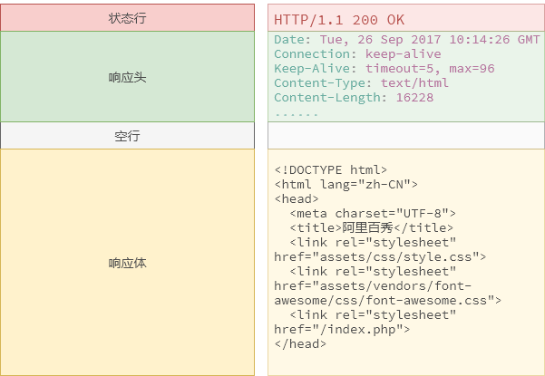

# 音乐列表与HTTP

## 每日目标
- 综合案例：**音乐列表**
- 能够说出任意三个常见的请求头以及函数
- 能够说出响应报文的组成
- 能够识别常见的状态码以及含义


# 音乐列表案例

> 基于文件存储的音乐数据**增删改查**

## 思路分析

> 绝大多数情况下我们编写的应用功能都是在围绕着某种类型的数据做增删改查（Create / Read / Update / Delete）。

对于被增删改查的数据有几点是可以明确的：

- 结构相同的多条数据（可以认为是：一个数组，数组中的元素都具有相同的属性结构）
- 可以持久化（长久保存）

### 数据放在哪？

我们第一件事就是考虑数据放在哪（怎么存怎么取）？

目前我们接触到的技术方案中，只有文件可以持久化的保存内容（数据），所以一定是用文件存我们要操作的数据。

但是由于我们要存放的是一个有着复杂结构的数据，并不是简简单单的值，所以我们必须设计一种**能表示复杂结构数据的方式**。

例如，一行为一条数据，不同信息之间用 `|` 分割，同时约定好每个位置的数据含义：

```
59d632855434e | 错过 | 梁咏琪 | /uploads/img/1.jpg | /uploads/mp3/1.mp3
59d632855434f | 开始懂了 | 孙燕姿 | /uploads/img/2.jpg | /uploads/mp3/2.mp3
59d6328554350 | 一生中最爱 | 谭咏麟 | /uploads/img/3.jpg | /uploads/mp3/3.mp3
59d6328554351 | 爱在深秋 | 谭咏麟 | /uploads/img/4.jpg | /uploads/mp3/4.mp3
```

这种方式很简单，但是缺点也非常明显，所以我们迫切需要一个更好更方便的表示有结构数据的方式。

## JSON

JSON（JavaScript Object Notation） 是一种通过普通字符串描述数据的手段，用于表示有结构的数据。类似于编程语言中字面量的概念，语法上跟 JavaScript 的字面量非常类似。

### 数据类型

- null

  ```json
  null
  ```

- string

  ```json
  "hello json"
  ```

- number

  ```json
  2048
  ```

- boolean

  ```json
  true
  ```

- object

  ```json
  {
    "name": "zce",
    "age": 18,
    "gender": true,
    "girl_friend": null
  }
  ```

- array

  ```json
  ["zhangsan", "lisi", "wangwu"]
  ```

### 注意

1. JSON 中属性名称必须用双引号包裹
2. JSON 中表述字符串必须使用双引号
3. JSON 中不能有单行或多行注释
4. JSON 没有 `undefined` 这个值

### JSON 表述

有了 JSON 这种格式，我们就可以更加容易的表示拥有复杂结构的数据了。

```json
[
  {
    "id": "59d632855434e",
    "title": "错过",
    "artist": "梁咏琪",
    "images": ["/uploads/img/1.jpg"],
    "source": "/uploads/mp3/1.mp3"
  },
  {
    "id": "59d632855434f",
    "title": "开始懂了",
    "artist": "孙燕姿",
    "images": ["/uploads/img/2.jpg"],
    "source": "/uploads/mp3/2.mp3"
  },
  {
    "id": "59d6328554350",
    "title": "一生中最爱",
    "artist": "谭咏麟",
    "images": ["/uploads/img/3.jpg"],
    "source": "/uploads/mp3/3.mp3"
  },
  {
    "id": "59d6328554351",
    "title": "爱在深秋",
    "artist": "谭咏麟",
    "images": ["/uploads/img/4.jpg"],
    "source": "/uploads/mp3/4.mp3"
  }
]
```

## 功能实现

> 在服务端开发领域中所谓的**渲染**指的是经过程序执行得到最终的 HTML 字符串这个过程。
>

### 列表数据展示（展示类）

- 文件读取
- JSON 反序列化
  - json_decode 需要注意第二个参数
  - 如果希望以关联数组的方式而非对象的方式操作数据，可以将 json_decode 的第二个参数设置为 true
- 数组遍历 foreach
- PHP 与 HTML 混编

### 新增数据（表单类）

```sequence
客户端->服务端: GET /add.php\n获取一个添加音乐的表单
服务端->客户端: 响应一个空的表单页面
Note left of 客户端: 用户填写表单内容
客户端->服务端: POST /add.php\n提交用户数据的内容和选择的文件
Note right of 服务端: 接收并处理提交的数据
服务端->客户端: 跳转回列表页
```


- 表单使用（form action method enctype，input name label for id）
- 服务端表单校验并提示错误消息
  - empty 判断一个成员是否没定义或者值为 false（可以隐式转换为 false）
- 上传文件
  - 文件数量
  - 文件种类
  - 如果需要考虑文件重名的情况，可以给上传的文件重新命名（唯一名称）
- 单文件域多文件上传
  - name 一定 以 [] 结尾，服务端会接收到一个数组
- JSON 序列化
- 文件写入

### 删除数据

- 问号传参

  - 一般情况下，如果需要超链接点击发起的请求可以传递参数，我们可以采用 `?` 的方式

    ```html
    <a href="/delete.php?id=123">删除</a>
    ```

- 数组中查找是否有指定元素

  - `in_array`

- 数组移除元素

  - `array_splice`


# HTTP：HTTP协议

## 概要

### 定义

HTTP（HyperText Transfer Protocol，超文本传输协议）最早就是计算机与计算机之间沟通的一种标准协议，这种协议规范了通讯**内容的格式**以及各项**内容的含义**。


随着时代的发展，技术的变迁，这种协议现在广泛的应用在各种领域，也不仅仅局限于计算机与计算机之间，手机、电视等各种智能设备很多时候都在使用这种协议通讯，所以一般现在称 **HTTP 为端与端之间的通讯协议**。

Web 属于 B/S 架构的应用软件，在 B/S 架构中，浏览器与服务器沟通的协议就是 HTTP 协议，作为一个合格的 Web 开发者，了解 HTTP 协议中约定的内容是一门必修课。

> 应用软件架构一般分为两类：
>
> - B/S 架构：Browser（浏览器） ←→ Server（服务器），这种软件都是通过浏览器访问一个网站使用，服务器提供数据存储等服务。
> - C/S 架构：Client（客户端） ←→ Server（服务器），这种软件通过安装一个软件到电脑，然后使用，服务器提供数据存储等服务。

### 约定形式

1. 客户端通过随机端口与服务端某个固定端口（一般为80）**建立连接** 三次握手
   1. 客户端向服务器发送一个连接请求
   2. 服务器向客户端返回一个确认信息
   3. 客户端将请求及这个确认信息发送服务器
2. 客户端通过这个连接**发送请求**到服务端（这里的请求是名词）
3. 服务端监听端口得到的客户端发送过来的请求
4. 服务端通过连接响应给客户端状态和内容（响应报文）

> 要求：接下来的一个月，每次上网打开任何一个页面时都要能够脑补这个画面，默念这个流程。

### 约定内容

- 请求 / 响应报文格式
- 请求方式 —— GET / POST / etc.
- 响应状态 —— 200 / 404 / 302 / 304 / etc.
- 预设的请求 / 响应头

## 核心概念

### 报文

#### 请求报文


##### 请求行

`GET /demo.php HTTP/1.1`

请求方式 + 空格 + 请求路径 + 空格 + HTTP 协议版本

##### 请求头

客户端想要告诉服务端的一些额外信息，以下为常见的请求头：

| 键               | 值                           |
| --------------- | --------------------------- |
| Host            | 请求的主机                       |
| Cache-Control   | 控制缓存（例如：max-age=60 缓存 60 秒） |
| Accept          | 客户端想要接收的文档类型，逗号分隔           |
| User-Agent      | 标识什么客户端帮你发送的这次请求            |
| Referer         | 这次请求的来源                     |
| Accept-Encoding | 可以接受的压缩编码                   |
| Cookie          | 客户端本地的小票信息                  |

##### 请求体

这次请求客户端想要发送给服务端的数据正文，一般在 GET 请求时很少用到，因为 GET 请求主观上都是去“拿东西”。

#### 响应报文



##### 状态行

`HTTP/1.1 200 OK`

HTTP 协议版本 + 空格 + 状态码 + 空格 + 状态描述

##### 响应头

服务端想要告诉客户端的一些额外信息，常见的有以下：

| 键              | 值          |
| -------------- | ---------- |
| Date           | 响应时间       |
| Server         | 服务器信息      |
| Content-Type   | 响应体的内容类型   |
| Content-Length | 响应的内容大小    |
| Set-Cookie     | 让客户端设置一个小票 |

如果需要在程序中设置自定义的响应头（不是预设的），建议使用 `X-<Property-Name>` 规则

##### 响应体

这次请求服务端想要返回给客户端的数据正文，一般返回的都是 HTML，也可以返回 JavaScript 或者 CSS（需要修改响应头中的响应类型）。

#### 应用场景

- 设置响应文件类型

  - `header('Content-Type: text/css');`
  - 常见的 HTTP MIME type：`text/css` `text/html` `text/plain` `applcation/javascript`

- 重定向（跳转到其他网页）

  - `header('Location: https://www.baidu.com');`

- 下载文件

  ```php
  // 让文件下载
  header('Content-Type: application/octet-stream');
  // 设置默认下载文件名
  header('Content-Disposition: attachment; filename=demo.txt');
  ```

- 图片防盗链

  - 通过判断请求来源 `Referer` 是否为本网站从而区分是否是合法请求

### 请求方式

> http://www.w3school.com.cn/tags/html_ref_httpmethods.asp
>
> http://www.runoob.com/http/http-methods.html

#### GET

字面意思：拿，获取

#### POST

字面意思：发，给

#### 对比 GET 与 POST

|          | GET                                      | POST                                     |
| -------- | ---------------------------------------- | ---------------------------------------- |
| 后退按钮/刷新  | 无害                                       | 数据会被重新提交（浏览器应该告知用户数据会被重新提交）。             |
| 书签       | 可收藏为书签                                   | 不可收藏为书签                                  |
| 缓存       | 能被缓存                                     | 不能缓存                                     |
| 编码类型     | application/x-www-form-urlencoded        | application/x-www-form-urlencoded 或 multipart/form-data。为二进制数据使用多重编码。 |
| 历史       | 参数保留在浏览器历史中。                             | 参数不会保存在浏览器历史中。                           |
| 对数据长度的限制 | 是的。当发送数据时，GET 方法向 URL 添加数据；URL 的长度是受限制的（URL 的最大长度是 2048 个字符）。 | 无限制。                                     |
| 对数据类型的限制 | 只允许 ASCII 字符。                            | 没有限制。也允许二进制数据。                           |
| 安全性      | 与 POST 相比，GET 的安全性较差，因为所发送的数据是 URL 的一部分。在发送密码或其他敏感信息时绝不要使用 GET ！ | POST 比 GET 更安全，因为参数不会被保存在浏览器历史或 web 服务器日志中。 |
| 可见性      | 数据在 URL 中对所有人都是可见的。                      | 数据不会显示在 URL 中。                           |

### 状态码

> 了解即可，不用刻意去记忆，用多了自然就忘不了。
>
> http://www.w3school.com.cn/tags/html_ref_httpmessages.asp

状态代码由三位数字组成，第一个数字定义了响应的类别，且有五种可能取值。

- 1xx：指示信息 —— 表示请求已接收，继续处理。
- 2xx：成功 —— 表示请求已被成功接收、理解、接受。
- 3xx：重定向 —— 要完成请求必须进行更进一步的操作。
- 4xx：客户端错误 —— 请求有语法错误或请求无法实现。
- 5xx：服务器端错误 —— 服务器未能实现合法的请求。

常见状态代码、状态描述的说明如下。

- 200 OK：客户端请求成功。
- 400 Bad Request：客户端请求有语法错误，不能被服务器所理解。
- 401 Unauthorized：请求未经授权，这个状态代码必须和 `WWW-Authenticate` 报头域一起使用。
- 403 Forbidden：服务器收到请求，但是拒绝提供服务。
- 404 Not Found：请求资源不存在，举个例子：输入了错误的URL。
- 500 Internal Server Error：服务器发生不可预期的错误。
- 503 Server Unavailable：服务器当前不能处理客户端的请求，一段时间后可能恢复正常。
