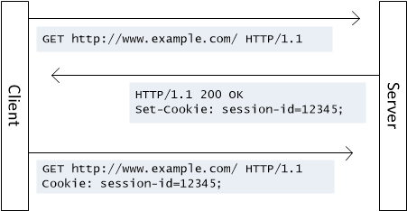
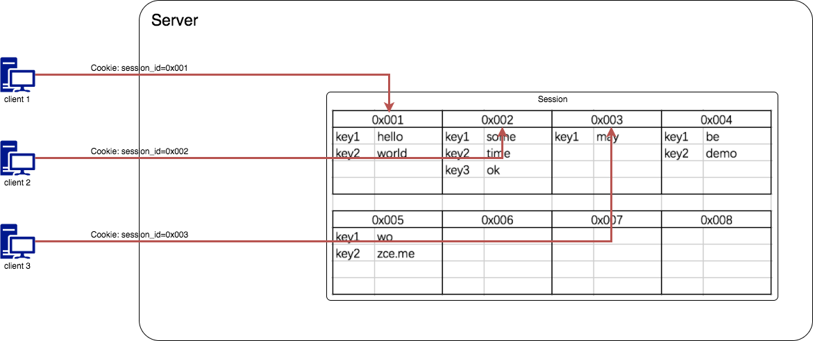
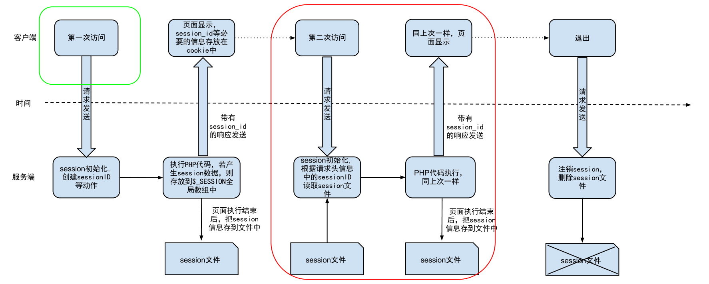
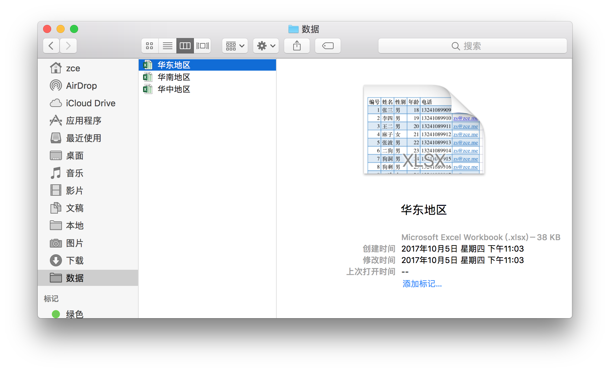
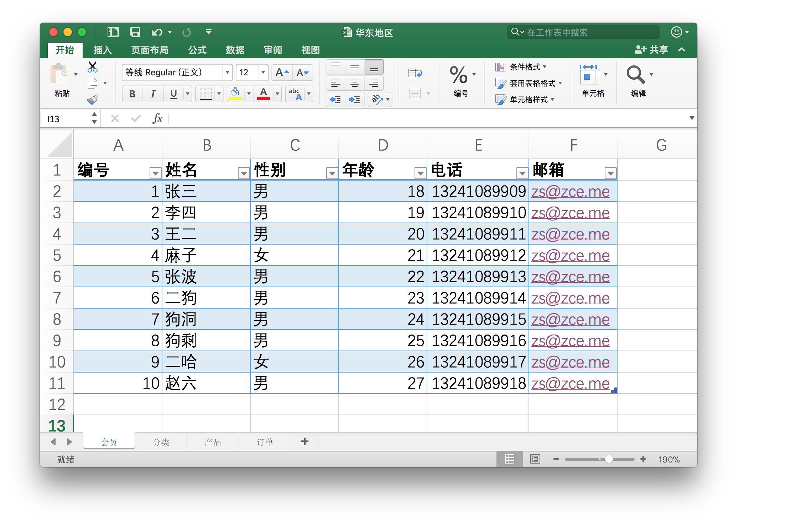

# Cookie、Session 与 MySQL

## 每日目标
- 掌握在服务端操作Cookie的方式
- 掌握在服务端操作Session的方式
- 能够说出Cookie与Session的关系与区别
- 能够完成登录案例
- 能够使用SQL语句对表进行增删改查操作
- 能够使用数据库可视化工具对表进行增删改查操作

## HTTP 会话

在计算机术语中，会话是指一个终端用户与交互系统进行通讯的过程。比如：`在浏览器中输入一个网址,单击确认，服务器返回相应的页面，你在页面中执行相应的操作，最后关闭页面` 就是一个会话过程

##HTTP无状态

“无状态”是指HTTP协议对于事务的处理没有记忆能力。意味着，协议本身不会在处理事务的过程中针对【之前】的信息进行存储，如果在处理当前步骤的时候需要【之前】的信息，则必需重传

##HTTP状态保持

### Cookie

HTTP 很重要的一个特点就是**无状态**（每一次见面都是“初次见面”），如果单纯的希望通过我们的服务端程序去记住每一个访问者是不可能的，所以必须借助一些手段或者说技巧让服务端记住客户端， **Cookie**就可以实现这种操作。



Cookie 就像是在超级市场买东西拿到的小票，由超市（Server）发给消费者（Browser），超市方面不用记住每一个消费者的脸，但是他们认识消费者手里的小票（Cookie），可以通过小票知道消费者之前的一些消费信息（在服务端产生的数据）。

#### cookie原理分析

- 一个cookie的设置以及发送过程分为以下四步
  1. 客户端发送一个http请求到服务器端 
  2. 服务器端发送一个http响应到客户端，其中包含Set-Cookie头部 
  3. 客户端发送一个http请求到服务器端，其中包含Cookie头部 
  4. 服务器端发送一个http响应到客户端 

#### 语法：

```php
setcookie(name[, value, expire, path, domain]);
```

#### cookie常用属性

- expires 有效期 

  - 临时COOKIE(缓存cookie)

    ```php
    setcookie("uName","admin");
    ```

  - 硬盘COOKIE

    ```php
    //一小时过期
    setcookie("uName","admin",time()+ 3600)
    //永久性COOKIE
    setcookie("password","123",PHP_INT_MAX);
    ```

- path有效 路径 

  ```php
  //只有在upload文件夹下才能被访问到
  setcookie("uName","admin",time()+ 3600,"/upload")
  ```

- domain 域名 

  - 域名：
    - 顶级：baidu.com
    - 二级域名
      - www.baidu.com
      - music.baidu.com
        - api.music.baidu.com
      - image.baidu.com

  ```php
  //只有在a.com以及它下面的子域名中才能被访问
  setcookie("uName","admin",time()+ 3600,"/","a.com")
  ```

#### 删除cookie

- 设置有效时间为过去时间

  ```php
  setcookie("uName","admin",time()-1);
  ```

- 将cookie中的值设置为false或者空字符串

  ```php
  setcookie("uName",false);
  //或者
  setcookie("uName","");
  ```

- 不设置值

  ```php
  setcookie("uName");
  ```

- 在浏览器中清除缓存

#### 服务器操作cookie

```php
// 设置cookie
// 
// 设置1小时后过期
setcookie("user", "lisi", time()+3600);
// 获取单个cookie
echo $_COOKIE["user"];
// 查看所有cookie
print_r($_COOKIE);
```

#### cookie的缺点：

- COOKIE数据不太安全；
- COOKIE存储的数据类型，只能是字符串；
- COOKIE文件是有容量限制(大约4KB)。4*1024b--> 1个文字大概是2~3b

#### 登录功能实现流程

```sequence
客户端->服务端: Request GET /login.php
服务端->客户端: Response 空白表单页面
Note left of 客户端: 用户填写表单
客户端->服务端: Request POST /login.php 表单数据
Note right of 服务端: 服务端对提交过来的数据进行校验
服务端->客户端: Response Location: /main.php\n跳转到 main.php
客户端-->服务端: Request GET /main.php
服务端-->客户端: Response Welcome
Note over 客户端,服务端: ..........
客户端->服务端: Request GET /login.php
服务端->客户端: Response 空白表单页面
```

### Session

由于 Cookie 是服务端下发给客户端**由客户端本地保存**的。换而言之客户端可以在本地对其随意操作，包括删除和修改。如果客户端随意伪造一个 Cookie 的话，对于服务端是无法辨别的，就会造成服务端被蒙蔽，构成安全隐患。

于是乎就有了另外一种基于 Cookie 基础之上的手段：**Session**：



Session 区别于 Cookie 一个很大的地方就是：Session 数据存在了服务端，而 Cookie 存在了客户端本地，存在服务端最大的优势就是，不是用户想怎么改就怎么改了。

Session 这种机制会更加适合于存放一些属于用户而又不能让用户修改的数据，因为客户端不再保存具体的数据，只是保存一把“钥匙”，伪造一把可以用的钥匙，可能性是极低的，所以不需要在意。



> http://php.net/manual/zh/session.examples.basic.php

#### session的优点：

- SESSION也是一种会话技术；
- SESSION数据存在服务器端，相对于比较安全；
- 服务器将SESSION数据保存在服务器上，而将SESSION的用户id存储在客户端电脑上。
- SESSION存储的数据类型，除了资源外的数据类型都可以；
- SESSION文件没有大小限制；

#### session原理分析

- 客户端第一次请求服务器时，服务器开启一个session，生成一个唯一标识（sessionid：存储的数据与此sessionid关联），并以响应头的Set-Cookie属性响应到客户端
- 客户端的后续请求会一直通过请求头的Cookie属性携带sessionid（客户端与服务器通过此id维持状态）

#### session基本操作

- 设置session

```
session_start();
```

```
$_SESSION['user'] = array('username'=>'lisi','age'=>'12');
```

- 读取session

```
session_start();
```

```
$user = $_SESSION['user'];
```

- 删除一个session信息

```
session_start();
```

```
unset($_SESSION['user']);
```

- 删除所有session信息

```
session_start();
```

```
unset($_SESSION);
$_SESSION = []
```

- 销毁session

```
session_destroy();
```

#### session与cookie的关系

- session可以借助cookie实现状态维持，也可以不依赖cookie（URL重写）

| 区别               | cookie                 | session                |
| ------------------ | ---------------------- | ---------------------- |
| 存储位置           | 浏览器                 | 服务器                 |
| 浏览器携带的数据量 | 多                     | 少（只携带session-id） |
| 存储的数据类型     | 只能是字符串           | 任意类型               |
| 安全性             | 较低                   | 较高                   |
| 默认的有效路径     | 当前路径及其子路径     | 整站有效               |
| 数据的传输量       | 有限制4K，不能超过20个 | 无限制                 |

## MySQL

### 准备工作

#### 简介

> 目标：
>
> - 搞明白什么是数据库
> - 如何通过工具操作数据库
> - 如何通过代码操作数据库

数据库就是数据的仓库，用来按照特定的结构去组织和管理我们的数据，有了数据库我们就可以更加方便、便捷的操作（C / R / U / D）我们需要保存的数据。

不管是什么数据库，最终都是将数据存到文件（硬盘）中，只是存储的格式不同于文本文件。

一个 Excel 文件就可以看做一个数据库：



一个 Excel 文件中可以包含多个数据表：



### 基础操作

#### 数据库管理工具

数据库管理工具本质上就是一个使用数据库服务器软件（Server）提供的服务的数据库客户端（Client）。

##### 命令行工具(了解)

一般如果只是简单操作数据库，可以使用 MySQL 内置的命令行工具完成：

进入 MySQL 客户端的 REPL 环境过后，可以通过标准的 SQL 语句操作数据库。

常见的操作指令：

```sql
mysql> show databases;  -- 显示全部数据库
mysql> create database <db-name>;  -- 创建一个指定名称的数据库
mysql> use <db-name>;  -- 使用一个数据库，相当于进入指定的数据库
mysql> show tables;  -- 显示当前数据库中有哪些表
mysql> create table <table-name> (id int, name varchar(20), age int);  -- 创建一个指定名称的数据表，并添加 3 个列
mysql> desc <table-name>;  -- 查看指定表结构
mysql> source ./path/to/sql-file.sql  -- 执行本地 SQL 文件中的 SQL 语句
mysql> drop table <table-name>;  -- 删除一个指定名称的数据表
mysql> drop database <db-name>;  -- 删除一个指定名称的数据库
mysql> exit|quit;  -- 退出数据库终端
```

##### 可视化工具

如果需要复杂的操作，推荐 Navicat Premium

> 下载地址：http://www.navicat.com.cn/download/navicat-premium
>
> 这是一个付费软件，可以免费试用 14 天

#### 基本概念

- 数据库
- 表
- 字段 —— 指的就是列
- 字段类型 —— 指的就是列能够存储的数据种类
  - int
  - char(<length>)
  - varchar(<length>)
  - date
  - decimal
- 数据库查询：指的是操作数据库的过程（查、增、删、改）
- 数据库查询语言：SQL

#### 基本查询语句

##### 查询

```sql
-- 查询数据
-- select 字段[, 字段2] from 表名
select id, name, birthday from users;

-- 通配 * 找到表中所有列
select * from users;
```

##### 增加

```sql
-- 新增数据
-- 插入全部字段
insert into users values (null, '王五', 0, '2020-12-12', '12312');
-- 指定字段
insert into users (name, gender, avatar) values ('王五', 0, '12312');
```

##### 修改

```sql
-- 更新数据
update users set name = '麻子', gender = 0
```

##### 删除

```sql
-- 删除
-- 删除语句必须指定条件
delete from users 
```

##### 筛选条件

子语句

```sql
delete from users where id = 6
delete from users where id = 6 and gender = 0
delete from users where id = 6 or gender = 0
delete from users where id > 6
delete from users where id in (4, 5)
```

#### 常见查询函数

- 总条数 —— count 分页功能，查询总页数
- 最大值、最小值 —— max/min
- 平均值 —— avg

```sql
select fn(field1) from table
```