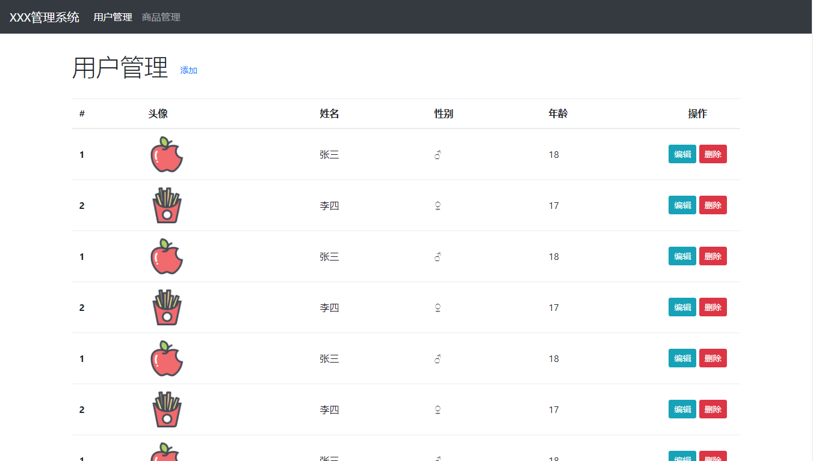
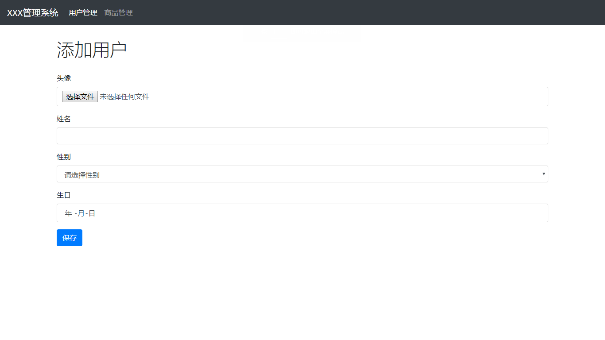

# PHP操作MySQL

## 每日目标 

- 能够使用php连接MySQL数据库
- 能够使用php对MySQL进行查询操作
- 能够使用php检测非查询操作的受影响行数
- 能够断开与数据库的连接
- 综合案例：**能够完成用户管理案例**

  ​


## PHP 操作数据库

如何在 PHP 代码中操作数据库是我们能否在自己的程序中使用数据库的核心。

> 数据库扩展：http://php.net/manual/zh/refs.database.php

如果需要使用 MySQLi 扩展，需要在 php.ini 文件中打开这个扩展（解除注释）

```php
// 假定数据库用户名：root，密码：123456，数据库：baixiu
$connection = mysqli_connect("localhost", "root", "123456", "baixiu");

if (!$connection) {
  // 如果连接失败报错
  die('<h1>Connect Error (' . mysqli_connect_errno() . ') ' . mysqli_connect_error() . '</h1>');
}

$sql = "select * from users";
$result = mysqli_query($connection, $sql);

// 查询数据填充到关联数组
while ($row = mysqli_fetch_assoc($result)) {
  echo $row["id"] . " - " . $row["username"];
}

// 释放结果集
mysqli_free_result($result);

mysqli_close($connection);
```

### 执行查询语句

#### 返回值：

#### 查询语句执行成功,返回资源型resource（结果集）。失败为false

1. 失败的情况：返回false

2. 空结果集情况:查询不到内容，返回空结果集，但是返回的类型是资源型

3. 非空结果集：查询结果集数据类型为资源型

4. 解析结果集的三种方式

   l  mysql_fetch_row()：返回索引数组

   l  mysql_fetch_assoc()：返回关联数组。

   l  mysql_fetch_array()：返回混合数组。

   1)	mysqli_fetch_array(resource $res);
   	返回结果集中的一行，以混合数组形式返回。既有数字下标，又有字符下标（查询各个字段名称）。
   	使用查询字段的名称作为字符下标。
   	函数的参数必须为查询结果集
   	每次执行移动一次指针，返回一行数据。
   2)	mysqli_fetch_row($res);
   	返回为索引数组。
   3)	mysqli_fetch_assoc($res);

	返回关联数组，元素下标为查询字段的名称。

### 执行非查询语句

> - 函数使用：mysqli_query(＄link，$sql);
>   - http://php.net/manual/zh/book.mysqli.php
>   - http://www.runoob.com/php/php-ref-mysqli.html
> - 注意事项：当变量的类型是字符串时，必须在外面添加单引号或双引号


## 用户管理案例

基于数据库的增删改查

### 用户查询与删除功能



### 用户新增与修改功能


